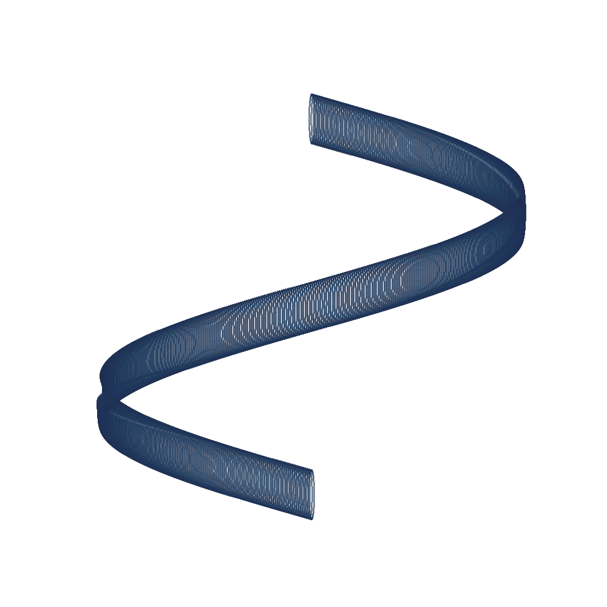
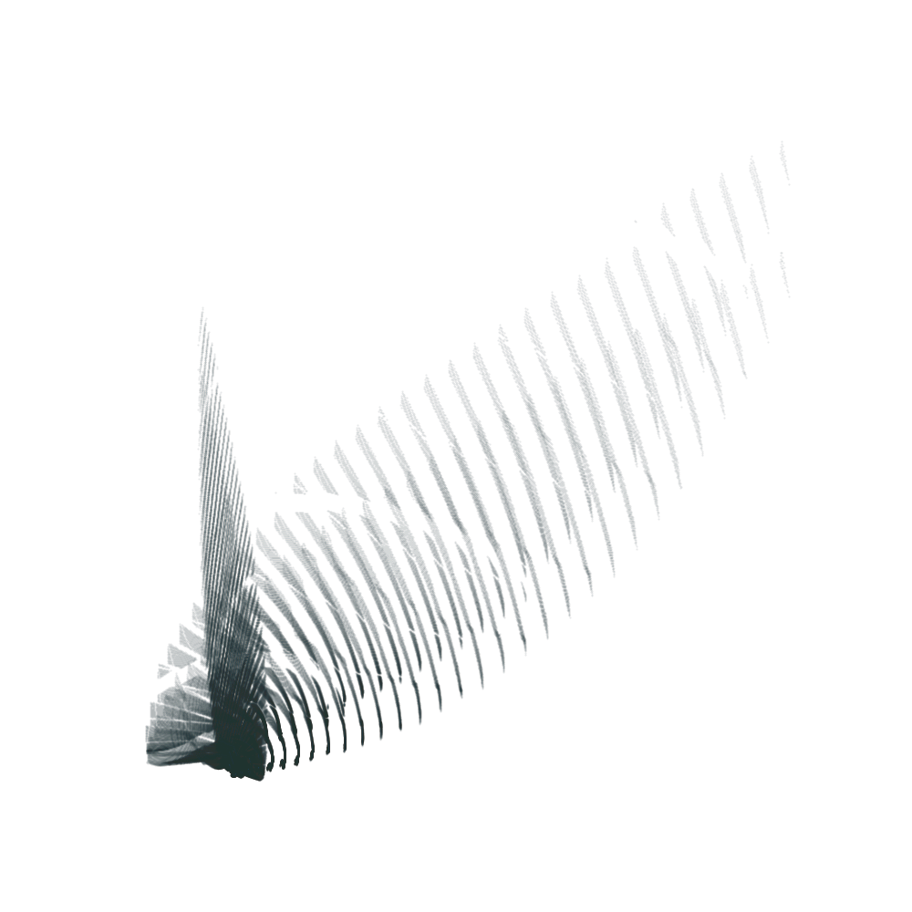
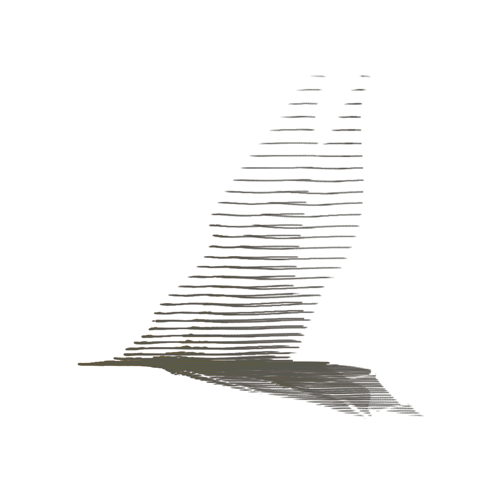
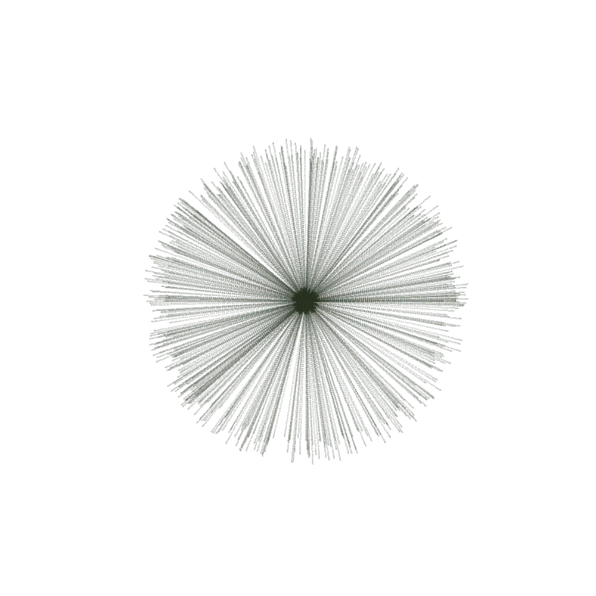
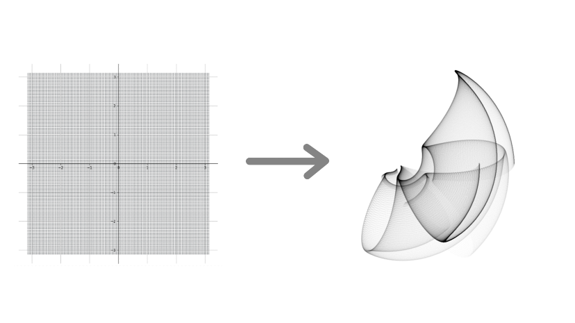
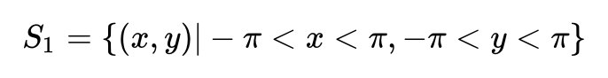
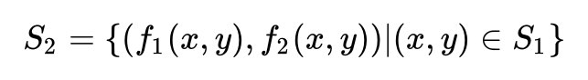
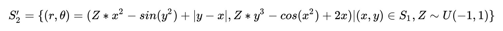
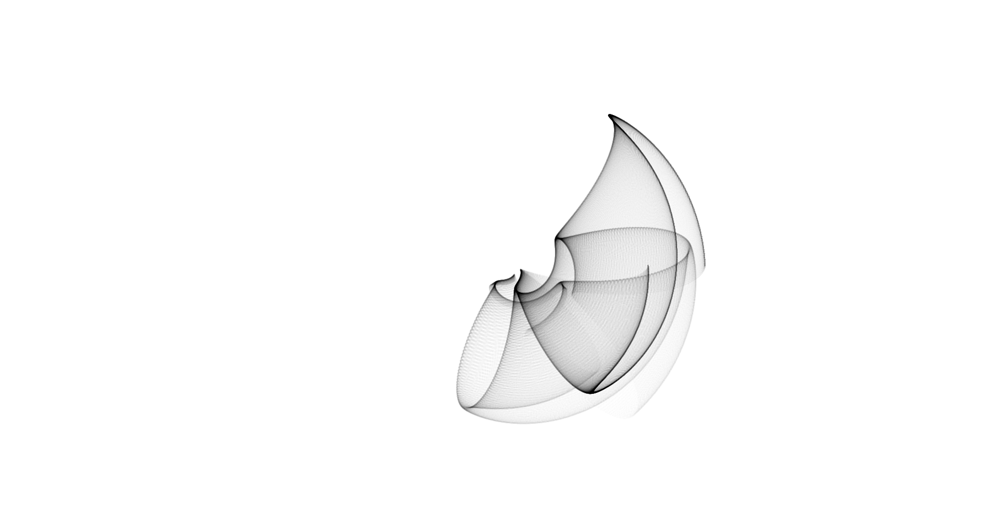

<div align="center">

<br/>
<h1>Zil Gen</h1>
</div>

----------

## Overview


<p align="justify">	
In this work I tried to generate generative arts for <a href="https://gitcoin.co/issue/Zilliqa/Zilliqa/2714/100026476">[ZILLIQA ON GITCOIN: NFTs BEYOND ART] Generative Art Pieces</a> that can serve as unique memorabilia or even avatars.
This project is based on our other library called <a href="https://github.com/sepandhaghighi/samila">Samila</a> and consist of two main part:

1. Generative Wallpapers
2. Generative Z-Style Avatars

</p>


## Requirements

1. [Samila](https://github.com/sepandhaghighi/samila)
2. [Art](https://github.com/sepandhaghighi/art)

`pip3 install -r requirements.txt`

## Generative Wallpapers

`python3 rand_gen.py`

This part lets you create infinite unique wallpapers based on many thousand points. The position of every single point is calculated by a formula, which has random parameters. Because of the random numbers, every image looks different.

Parameters :

1. Input formula
2. Projection
3. Color
4. Spot size

### Sample1
	

```
F1 : 30.586*y**2*x**1.59-27.055*abs(y-x)**1.646-22.722*math.cos(y**2)**1.108-26.326*math.ceil(x*y)**1.326+35.621*math.ceil(x-y)**1.706+16.248*abs(x**2*y)**1.636

F2 : 45.519*math.sin(y)**1.374+2.565*abs(y**2*x)**1.416+19.316*x**1.703-14.939*x**2**1.78+31.781*math.floor(y**2*x)**1.445

Seed : 690765

Color : (0.167, 0.2, 0.184)

Projection : Projection.RECTILINEAR

Spot Size : 0.29045928118447506

```

### Sample2
	

```
F1 : 46.739*math.floor(y**2*x)**1.444-18.103*math.sin(y**2)**1.871-11.165*math.cos(x**2)**1.07-14.044*math.cos(y**2*x)**1.885-23.404*math.sin(x)**1.175+42.816*math.sin(y-x)**1.572

F2 : 37.384*abs(x)**1.811+33.06*math.sin(x*y)**1.415+16.468*abs(x)**1.817+14.806*math.ceil(y-x)**1.042+45.238*abs(y)**1.204

Seed : 202731

Color : (0.465, 0.35, 0.247)

Projection : Projection.RECTILINEAR

Spot Size : 1.9499281137566082

```

### Sample3
	

```
F1 : 11.516*x+y**1.034-42.219*math.sin(x)**1.423

F2 : 41.56*math.sin(y**2)**1.011

Seed : 728376

Color : (0.206, 0.164, 0.005)

Projection : Projection.POLAR

Spot Size : 1.7475050745556027

```

For more example take a look at [Wallpapers]() folder


## Z-Style Avatars

`python3 rand_gen.py`

This part lets you create infinite unique z-style avatars based on many thousand points. The position of every single point is calculated by a formula, which has random parameters. Because of the random numbers, every image looks different.

Parameters :

1. Input formula
2. Color
3. Spot size

### Sample1

```
```

### Sample2

```
```

### Sample3

```
```

For more example take a look at [Z_Style]() folder

## Technical Details
A transformation between a square-shaped space from the Cartesian coordinate system to any arbitrary coordination like [Polar coordinate system](https://en.wikipedia.org/wiki/Polar_coordinate_system).

### Example


We have set of points in the first space (left square) which can be define as follow:



And bellow functions are used for transformation:

```pycon
>>> def f1(x,y):
    result = random.uniform(-1,1) * x**2  - math.sin(y**2) + abs(y-x)
    return result
>>> def f2(x,y):
    result = random.uniform(-1,1) * y**3 - math.cos(x**2) + 2*x
    return result
```



here we uses `Projection.POLAR` so later space will be the polar space and we have:

```pycon
>>> g = GenerativeImage(f1,f2)
>>> g.generate(seed=10)
>>> g.plot(projection=Projection.POLAR)
```




